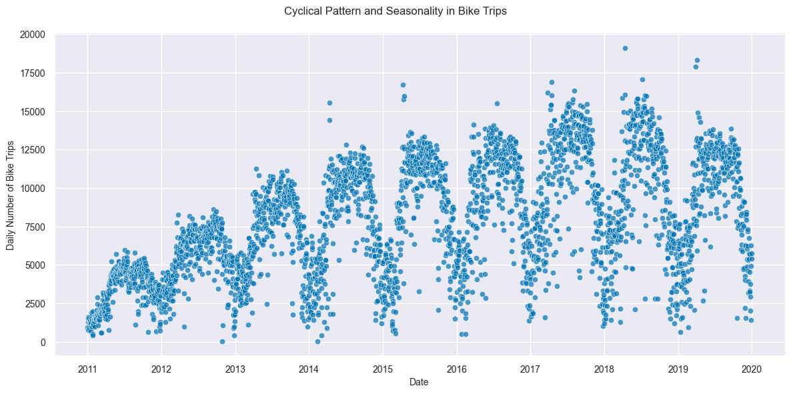
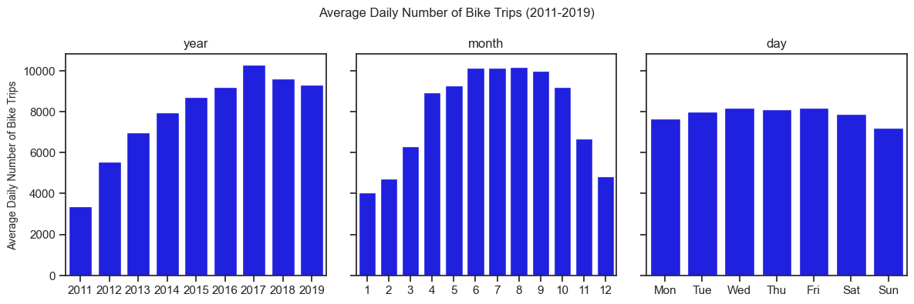
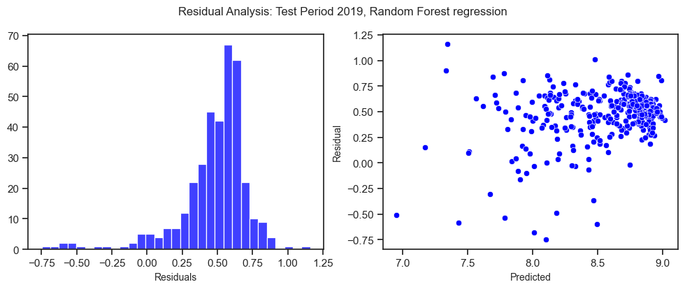

# Time Series Demand Prediction - Capital Bikeshare Program

[Sebastian Buenker](https://github.com/sbuenker)

[Megan Leal Causton](https://github.com/mhleal)

[Kristin Engelke](https://github.com/Krissi123)

[Salil Pachare](https://github.com/saliloquy)

### Overview
For this project, a fictional stakeholder, namely the management board at Capital Bikeshare, has retained an outside data science consulting firm to create a daily demand prediction model for its rental bikes in Washington DC. The requirements are that the model should be as simple as possible, using features which are publicly available. For this project, we therefore used calendar and weather features. 

To replicate this project, please refer to the Installation document, located [here](installation.md). For detailed exploratory data analysis and regression analysis, click [here](bike_share_demand_prediction.ipynb). For a Python script to execute the regression analysis from the command line, click [here](regressions.py).

### Data Sources
The data on bike trips is obtained from the [Capital Bikeshare website](https://s3.amazonaws.com/capitalbikeshare-data/index.html) from 2011-2019. Approximately 25 million bike trip are aggregated so that we have one observation per day (total number of bike trips/day). Our final dataset has approximately 3,300 observations.

Daily historic weather data for Washington DC is obtained from the [National Oceanic and Atmospheric Administration](https://www.ncei.noaa.gov/cdo-web/datasets/GHCND/stations/GHCND:USW00013743/detail). We use the weather station located at Washington Reagan Airport (approximately 5km from Downtown Washington DC), due to the continuity in data that spans our time period. 

### Exploratory Data Analysis

There are four main findings from the figures above:
1. There is a cyclical pattern in bike rentals over the year, with the daily number of bike trips peaking during the summer months.
2. There are some recurring outliers in the number of bikes in early April each year, which corresponds to the peak bloom in the Washington DC Cherry Blossom festival. 
3. There is a drop in the daily number of bike trips in 2018 and 2019, which coincides with the introduction of e-scooter rentals.
4. Average daily number of bike rentals is lower on Sundays and peaks in the middle of the week.

### Feature Engineering
* We use calendar features, namely, day of the week, month and year dummy variables, and dummy variables to encode public holidays in Washington DC.
* To account for the cyclical nature of weeks and years, we use sine and cosine transformations for days of the week and days of the year. 
* For certain specifications, we use daily average wind speed, daily minimum and maximum temperature, snow and snow depth. Except for daily minimum and maximum temperature, we apply a log transformation to the weather features to minimize the effects of skewness.
* We standardize all features by subtracting mean and dividing by standard deviation.
* We use a log transformation on the number of bikes (dependent variable).

### Model Training and Testing
* We use 2011-2018 as the training period for model estimation.
* We use 2019 as the test (forecasting) period.

### Model Metrics
* $R^2$ cannot be easily interpreted in some models like Poisson regression and may be prone to inferential concerns with non-cointegrated time series data (spurious regressions).
* For ease of interpretation for our stakeholder, we use the Mean Absolute Percentage Error (MAPE) as our measure for model comparison.

### Model Results
We test various models including, linear regression, polynomial regression, Ridge regression (to regularize coefficients and prevent overfitting), Poisson regression (to account for count data nature of bike rentals), Random Forest model and finally an XGBoost model.

|Model|Features|Train MAPE|Test MAPE|
|---|---|---|---|
|Linear regression|Calendar|0.029|0.115
|Polynomial regression (deg=2)|Calendar|0.025|0.116
|Ridge regression|Calendar|0.025|0.116
|Poisson regression|Calendar|0.033|0.080
|Linear regression|Calendar + Weather|0.021|0.114
|Polynomial regression (deg=2)|Calendar + Weather|0.012|0.115
|Ridge regression|Calendar + Weather|0.012|0.111
|Poisson regression|Calendar + Weather|0.025|0.076
|Random Forest|Calendar + Weather|0.010|0.056
|XGBoost|Calendar + Weather|0.000|0.105

### Residual Analysis
Due to its good performance in- and out-of-sample, we choose the Random Forest model. We perform residual analysis on this model by checking the normality of the residuals, the randomness of residuals using a scatter-plot and perform an Augmented Dickey Fuller test of residuals to test their stationarity.

The residuals somewhat resemble normality and are randomly distributed. 

    ADF Test for Residual Stationarity
    ADF Statistic: -2.786490
    p-value: 0.060230
    Critical Values:
	    1%: -3.449
	    5%: -2.870
	    10%: -2.571

    
The residuals are stationary (at the 10% level) according to the Augmented Dickey Fuller test (the null hypothesis is the residuals are non-stationary). Given the fact that the number of bikes is non-stationary and the residuals are stationary, this suggests that co-integration is at play and this should not affect the quality of our forecasts for 2019.

### Recommendations
Based on the results, we would recommend using a Random Forest model with weather and calendar features. MAPE for the forecasting/test period in 2019 is 0.056, that is, on average, our forecast is 5.6% different from the actual observations.

To calculate the revenue loss under the baseline linear regression model and under the Random Forest, we assume the following:
* Variable revenue of $2.00 per bike rental ($1.00 to unlock, average bike trip of 20 mins at $0.05/min).
* Percentage difference in logs can be approximated as the raw percentage difference. This approximation holds for sufficiently small percentage differences. 

Given the average number of bikes/day rented in 2019 is 9311, the forecasted variable revenue loss is $380,330/year with the Random Forest model, as opposed to $774,530/year with the Linear Regression model with just calendar features. By just using a better daily demand prediction model, we are able to help the management at Capital Bikeshare save close to **$400,000/year!** 

