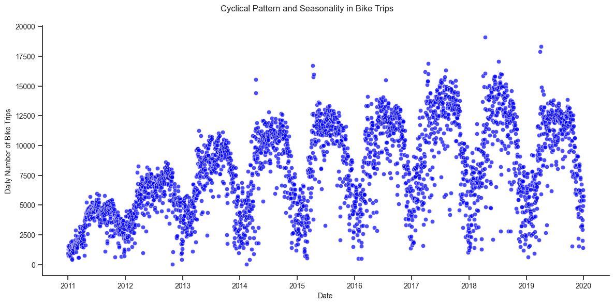

# Time Series Demand Prediction - Capital Bikeshare Program

### Overview
For this project, a fictional stakeholder, namely the management board at Capital Bikeshare, has retained an outside data science consulting firm to create a daily demand prediction model for its rental bikes in Washington DC, using a model with calendar and weather features.

To replicate this project, please refer to the Installation document, located [here](https://github.com/sbuenker/bike_sharing_wa-dc/blob/main/installation.md).

### Exploratory Data Analysis

There are four main findings from the figures above:
1. There is a cyclical pattern in bike rentals over the year, with the daily number of bike trips peaking during the summer months.
2. There are some recurring outliers in the number of bikes in early April each year, which corresponds to the peak bloom in the Washington DC Cherry Blossom festival. 
3. There is a drop in the daily number of bike trips in 2018 and 2019, which coincides with the introduction of e-scooter rentals.
4. Average daily number of bike rentals is lower on Sundays and peaks in the middle of the week.

### Feature Engineering
* We use calendar features, namely, day of the week, month and year dummy variables, and dummy variables to encode public holidays in Washington DC.
* To account for the cyclical nature of weeks and years, we use sine and cosine transformations for days of the week and days of the year. 
* For certain specifications, we use daily average wind speed, daily minimum and maximum temperature, snow and snow depth. Except for daily minimum and maximum temperature, we apply a log transformation to the weather features to minimize the effects of skewness.
* We standardize all features by subtracting mean and dividing by standard deviation.
* For certain regression models, we use a log transformation on the number of bikes (dependent variable)

### Model Training and Testing
* We use a 2011-2018 as the training period for model estimation, and 2019 as the test (forecasting) period.

### Model Metrics
* $R^2$ cannot be easily interpreted in some models like Poisson regression and may be prone to inferential concerns with non-cointegrated time series data (spurious regressions).
* For ease of interpretation for our stake holder, we use the Mean Absolute Percentage Error (MAPE) as our measure for model comparison.

### Model Results
|Model|Features|log(numbikes)|Train MAPE|Test MAPE|
|---|---|---|---|---|
|Linear regression|Calendar|No|0.474|0.694
|Linear regression|Calendar|Yes|0.029|0.115
|Polynomial regression (deg=2)|Calendar|Yes|0.025|0.116
|Ridge regression|Calendar|Yes|0.025|0.116
|Poisson regression|Calendar|Yes|0.033|0.080
|Linear regression|Calendar + Weather|Yes|0.021|0.114
|Polynomial regression (deg=2)|Calendar + Weather|Yes|0.012|0.115
|Ridge regression|Calendar + Weather|Yes|0.012|0.111
|Poisson regression|Calendar + Weather|Yes|0.025|0.076
|Random Forest|Calendar + Weather|Yes|0.010|0.056
|XGBoost|Calendar + Weather|Yes|0.000|0.105

### Residual Analysis
We perform residual analysis on the Random Forest model. We check the normality of the residuals, the randomness of residuals using a scatter-plot and perform an Augmented Dickey Fuller test of residuals.

The residuals somewhat resemble normality and are randomly distributed. Furthermore, the errors are stationary according to the Augmented Dickey Fuller test. Given the fact that the number of bikes is non-stationary and the residuals are stationary (p-value less than 0.05), this suggests that  co-integration is at play and this should not affect the quality of our forecasts for 2019.

### Recommendations
Based on the results, we would recommend using a Random Forest with log transformation of number of bikes, and weather and calendar features. MAPE for the forecasting/test period in 2019 is 0.056, that is, on average, our forecast is 5.6% different from the actual observations. 
